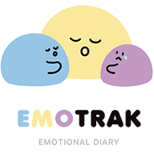
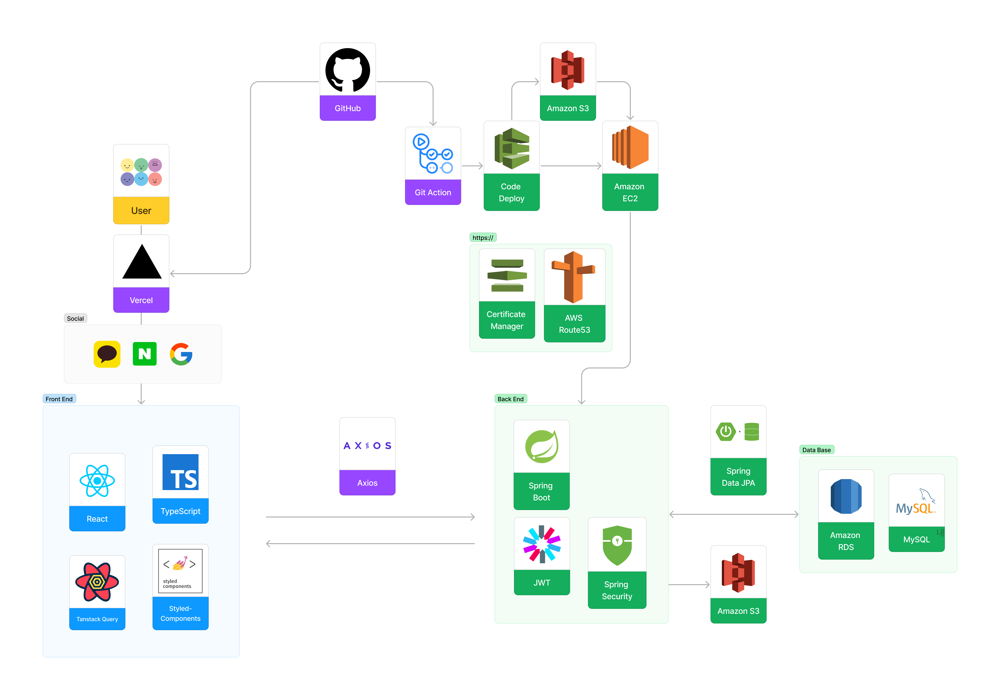

# EmoTrak - FrontEnd
 ## ✨ 프로젝트 소개 🔮

- 오늘 나의 기분은 어땠을까? 나의 감정을 털어놓을 곳 Emotion Tracking Diary, EmoTrak[이모트랙] 입니다.

[📝 EmoTrak 바로가기](https://emotrak.vercel.app/)

 

### 🧡 EmoTrak 💛

 

### 📆 프로젝트 기간

- 2023/03/31 ~ 2023/05/04

 

### 🖥️ 서비스 아키텍쳐

 

### 🥕 Front-end 기술선정 

#### React + Typescript

- 자바스크립트 라이브러리인 리액트를 중심으로 개발
- Typescript : 컴파일 단계에서 타입 관련 에러를 막을 수 있으며, 크로스 브라우징(브라우저 호환성) 문제 해결

 

#### React Query

- 캐싱 및 상태 관리: 원격 데이터를 자동으로 캐싱하고 관리함에 따라 불필요한 API 콜을 줄일 수 있어 서버에 부담을 줄임
- Redux의 불필요한 코드를 작성할 필요가 없음

 

#### 라이브러리 사용 최소화

- 라이브러리의 버전 업그레이드 종료 시에도 해당 기능을 구현을 할 수 있도록 JavaScript를 바탕으로 기능을 구현

 

### 🎨 와이어 프레임

[ 👉 기능 구성 와이어 프레임 ](https://www.figma.com/file/Vq54bZUqg8U7OGSPIQbfXd/%ED%95%AD%ED%95%B413%EA%B8%B0-%EC%8B%A4%EC%A0%84%ED%94%84%EB%A1%9C%EC%A0%9D%ED%8A%B8-4%EC%A1%B0?type=design&node-id=0-1&t=fZa6av9Kc6zCeTSE-0)

 

### 💻 프론트엔드 기술 스택

 

 

 

### 🔧 주요 기능

✏️ 감정일기 작성

- 그날의 감정을 일기로 작성하고 그림이나, 사진으로 감정을 표현할 수 있음
- 감정 이모티콘과 별점을 선택하여 하루의 기분을 이모티콘과 별점으로 나타낼 수 있음

📆 달력으로 그 날의 대표감정 알아보기

- 월 별 감정을 기록하여 해당 월 대표감정을 달력에 표시
- 감정 클릭 시 해당 일에 기록된 감정 확인

📊 차트를 통해 자신의 감정 통계 확인하기

- 월 별 나의 감정별 평균 점수 및 어떤 감정이 많았는지 감정 빈도 확인

👀 다른 사람들의 공유한 감정을 확인, 댓글달기

- 다른 사람들이 공유한 감정을 확인 하고, 좋아요 및 댓글을 달아서 소통을 할 수 있음
- 부적절한 게시물 또는 댓글을 신고하면 관리자가 모니터링 하여 삭제, 공유해제 가능

📱반응형 웹

- 반응형 웹 구현으로 모바일이나 태블릿으로도 서비스를 이용할 수 있도록 접근성 높임.

 

### 🔥 &nbsp;EmoTrak FE Wiki!
[📌 EmoTrak FE 코드 컨벤션 / 깃 플로우 / 트러블 슈팅 바로가기! ](https://github.com/EmoTrak/EmoTrak-FrontEnd/wiki)

 

### 🌹 About Front-end

#### 👪 &nbsp; 팀원

|   이름    |         깃허브 주소         |                 역할 분담                   |
| :-------: | :-------------------------: | :-------------------------------------------------------------: |
| 👧 윤지현 | https://github.com/jihyun-Yun42 |     달력 페이지, 공유게시판, 공유상세페이지       |
| 👧 양인서 | https://github.com/1nxeo |     일기작성페이지, 상세페이지, 로그인, 회원가입, 랜딩페이지 |
| 👦 박승우 | https://github.com/parkingbox |        차트 페이지, 관리자 페이지                |

