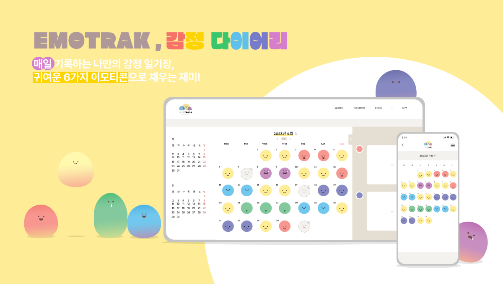

# EmoTrak - FrontEnd

## ✨ 프로젝트 소개 🔮

- 오늘 나의 기분은 어땠을까? 나의 감정을 털어놓을 곳 Emotion Tracking Diary, EmoTrak[이모트랙] 입니다.

[📝 EmoTrak 바로가기](https://emotrak.vercel.app/) | [⭐️ 팀 노션](https://1nxeo.notion.site/4-EmoTrak-0e155b9e771b4c659480f406933151f6)

 

### 🧡 EmoTrak 💛

 

### 📆 프로젝트 기간

- 2023/03/31 ~ 2023/05/04

 

### 🖥️ 서비스 아키텍쳐

 

### 🥕 Front-end 기술선정

#### React + Typescript

- 자바스크립트 라이브러리인 리액트를 중심으로 개발
- Typescript : 컴파일 단계에서 타입 관련 에러를 막을 수 있으며, 크로스 브라우징(브라우저 호환성) 문제 해결

#### React Query

- 캐싱 및 상태 관리: 원격 데이터를 자동으로 캐싱하고 관리함에 따라 불필요한 API 콜을 줄일 수 있어 서버에 부담을 줄임
- Redux의 불필요한 코드를 작성할 필요가 없음

#### 라이브러리 사용 최소화

- 라이브러리의 버전 업그레이드 종료 시에도 해당 기능을 구현을 할 수 있도록 JavaScript를 바탕으로 기능을 구현

 

### 🎨 와이어 프레임

[ 👉 기능 구성 와이어 프레임 ](https://www.figma.com/file/Vq54bZUqg8U7OGSPIQbfXd/%ED%95%AD%ED%95%B413%EA%B8%B0-%EC%8B%A4%EC%A0%84%ED%94%84%EB%A1%9C%EC%A0%9D%ED%8A%B8-4%EC%A1%B0?type=design&node-id=0-1&t=fZa6av9Kc6zCeTSE-0)

 

### 💻 프론트엔드 기술 스택

 

 

 

### 🔧 주요 기능

✏️ 감정일기 작성

- 그날의 감정을 일기로 작성하고 그림이나, 사진으로 감정을 표현할 수 있음
- 감정 이모티콘과 별점을 선택하여 하루의 기분을 이모티콘과 별점으로 나타낼 수 있음

📆 달력으로 그 날의 대표감정 알아보기

- 월 별 감정을 기록하여 해당 월 대표감정을 달력에 표시
- 감정 클릭 시 해당 일에 기록된 감정 확인

📊 차트를 통해 자신의 감정 통계 확인하기

- 월 별 나의 감정별 평균 점수 및 어떤 감정이 많았는지 감정 빈도 확인

👀 다른 사람들의 공유한 감정을 확인, 댓글달기

- 다른 사람들이 공유한 감정을 확인 하고, 좋아요 및 댓글을 달아서 소통을 할 수 있음
- 부적절한 게시물 또는 댓글을 신고하면 관리자가 모니터링 하여 삭제, 공유해제 가능

📱반응형 웹

- 반응형 웹 구현으로 모바일이나 태블릿으로도 서비스를 이용할 수 있도록 접근성 높임.

 

### 🔧 트러블 슈팅

프로텍티드 라우트

| 진행 순서 | 내용                                                                                                                                                                                                                                                                                                                                                                                                                                                                               |
| :-------- | :--------------------------------------------------------------------------------------------------------------------------------------------------------------------------------------------------------------------------------------------------------------------------------------------------------------------------------------------------------------------------------------------------------------------------------------------------------------------------------- |
| 😱 문제   | 라우터에서 권한 유무에 따라 페이지 이동 처리를 한번에 해주기 위해 Protected Route 기능을 도입하였는데,  리프레시 토큰 만료시, 자동으로 로그인 페이지로 넘어가지 않음. 유저피드백 : 로그인 후 달력페이지에서 뒤로가기를 누르면 로그인페이지에 진입이 가능함.                                                                                                                                                                                                                |
| 🤔 원인   | 프로텍티드 라우트 파일의 useEffect의 의존성 배열에 잘못된 값이 들어감.                                                                                                                                                                                                                                                                                                                                                                                                             |
| 😭 시도   | • props로 받아오는 값 변경(page의 isLogin, isPublic 값) 조건을 Router.tsx파일에서 설정해 주는것이 아닌, ProtectedRoute.tsx 파일에서 조건을 설정해주는 것으로 변경하기로 함. • 프로텍티드 라우트 파일의 useEffect 조건 변경  의존성배열에 refreshToken 을 넣어줌으로써 로그아웃 시(refreshToken의 값이 변경될 시)ProtectedRoute의 useEffect 내 로직이 실행되도록 변경 useEffect 내의 조건을 모두 if가 아닌 else if로 처리해줌으로써, 조건을 narrowing 해줌. |
| 😄 해결   | public 페이지에 로그인 된 상태로 진입 시, 로그인과 회원가입 페이지에는 진입할 수 없도록 조건 설정해줌.  의존성 배열에 pathname(useLocation을 사용하여 가져온 값)을 추가해주어, 뒤로가기를 연속으로 누르더라도  접근권한이 없는 페이지에는 접속 불가능.  페이지 별 useEffect를 걸어주지 않아도 권한이 없는 페이지에는 접근이 불가능해짐.                                                                                                                                |

그림일기 수정

| 진행 순서 | 내용                                                                                                                                                                                                                                                                                                                                                                                                                                                                                                                                                                                                                       |
| :-------- | :------------------------------------------------------------------------------------------------------------------------------------------------------------------------------------------------------------------------------------------------------------------------------------------------------------------------------------------------------------------------------------------------------------------------------------------------------------------------------------------------------------------------------------------------------------------------------------------------------------------------- |
| 😱 문제   | 그림일기 수정시 canvas 요소에 서버에서 전달해준 S3 버킷 url을 새로운 image 객체를 만들어 저장해준 뒤,  그 이미지를 그대로 canvas에 그려주는 작업을 하는데, tainted canvas 에러가 발생.                                                                                                                                                                                                                                                                                                                                                                                                                                 |
| 🤔 원인   | 이미지 객체 사용 시 crossOrigin 설정 오류.                                                                                                                                                                                                                                                                                                                                                                                                                                                                                                                                                                                 |
| 😭 시도   | • 이미지 객체 crossOrigin 설정을 해주어야겠다 판단 • anonymous 설정  ⇒ 캐싱된 데이터로 해결되는 것처럼 보였으나 시간이 지나면 여전히 CORS error가 발생하여 근본적으로 해결되지 않음 • 요청 인터셉터의 config에 'Access-Control-Allow-Origin'을 와일드카드(\*)로 설정해주면 해당 에러가 해결될  것이라고 생각  ⇒ request에서 처리를 해주는 것이 아닌, response 에서 처리를 해주는 부분인 것으로 판단되어, 백엔드와 함께  트러블 슈팅 시작 • Image 객체의 crossOrigin 설정이 anonymous 이면, same-origin에서의 이미지만 업로드가 가능  따라서 crossOrigin 설정을 use-credentials로 변경해줌. |
| 😄 해결   | • 프론트에서는 시도부분에 있는 코드와 같이 crossOrigin설정을 변경해주는 것 이외에는 더 처리해줄 것이 없었음 • 백엔드에서 해당 이미지를 CloudFront를 사용하여 헤더에 Access-Control-Allow-Origin을 배포url로 설정해줌으로써,tainted canvas 오류(CORS error)해결                                                                                                                                                                                                                                                                                                                                                     |

패럴렉스 스크롤 다중클래스 생성

| 진행 순서 | 내용                                                                                                                                                                                                                                                         |
| :-------- | :----------------------------------------------------------------------------------------------------------------------------------------------------------------------------------------------------------------------------------------------------------- |
| 😱 문제   | 패럴럭스 스크롤을 구현하면서, transform: translateX, Y에 의해 이미지 요소의 x,y값이 변경될때 마다  클래스이름이 새로 생성됨(클래스 폭발). 스크롤 버벅임.                                                                                             |
| 🤔 원인   | 기술적 의사결정 시 styled-components를 사용하기로 했던 이유이자 장점이었던 것이 트러블로 돌아옴.                                                                                                                                                             |
| 😭 시도   | • className을 각각 설정해주어 css로 처리할까 했으나, 그렇게 되면 styled-components를 사용하는 의미가  사라진다고 판단하게 되어 해당 사항 적용하지 않기로 함. • styled-components의 css 속성을 사용하여 해결하고자 했으나, 여전히 같은 문제가 발생함. |
| 😄 해결   | styled-components의 attrs를 이용하여, 스타일드 컴포넌트의 attribute(속성)로 계속 변경하는 값(transform)을 설정해주어, 요소의 x,y값이 번하더라도 className이 새로 생성되지 않도록 처리.                                                                   |

 

### 🌹 About Front-end

#### 👪 &nbsp; 팀원

|   이름    |           깃허브 주소           |                        역할 분담                         |
| :-------: | :-----------------------------: | :------------------------------------------------------: |
| 👑 윤지현 | https://github.com/jihyun-Yun42 |         달력 페이지, 공유게시판, 공유상세페이지          |
| 👧 양인서 |    https://github.com/1nxeo     | 일기작성페이지, 상세페이지, 로그인, 회원가입, 랜딩페이지 |
| 👦 박승우 |  https://github.com/parkingbox  |                차트 페이지, 관리자 페이지                |
